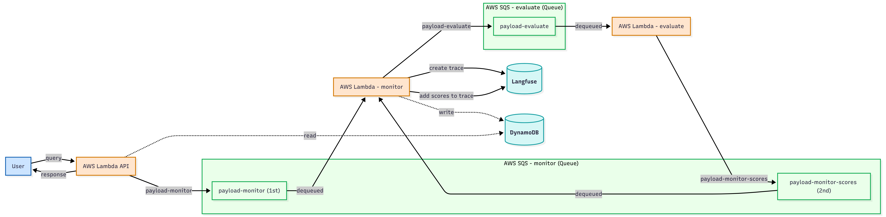

# PagoPA Chatbot - Discovery

This folder contains all the details to build a multi-agentic system (a system composed of multiple collaborating AI agents), named **Discovery**, with RAG (Retrieval-Augmented Generation, which enhances responses by retrieving relevant information from external sources) using the documentation provided in [`PagoPA Developer Portal`](https://developer.pagopa.it/).

This chatbot uses [Google](https://ai.google.dev/) as provider; specifically, it uses an LLM and an Embedder models of the [Gemini](https://ai.google.dev/gemini-api/docs/models) family via Google Cloud's Vertex AI, authenticated with a Google Cloud service account (see the **Gemini** section below for setup details).

The multi agentic system and the Retrieval-Augmented Generation (RAG) tools are implemented using [llama-index](https://docs.llamaindex.ai/en/stable/).

> **Note:** The environmental variables, parameters, and prompts referenced in `src/modules/settings.py` pertain to the Python backend service. If you are working with the TypeScript codebase, settings are managed via environment files (e.g., `.env.local`) and TypeScript configuration files.

The LLM observability is done using [Langfuse](https://langfuse.com/) deployed on AWS.

This folder contains the code and the API that are deployed in an AWS lambda function called **AWS lambda API**, read below for furher information.

## Gemini

If you wish to use Gemini models, you need to:

- create a project in Google Cloud Platform
- create google service account and store them into the file `.google_service_account.json`
- ensure that you can use [VertexAI](https://cloud.google.com/vertex-ai?hl=en) and [Discovery Engine](https://docs.cloud.google.com/generative-ai-app-builder/docs/reference/rest)

## Docker

The Docker Compose is set to emulate the deployed application in AWS using [Motoserver](https://docs.getmoto.org/en/latest/). The infrastructure uses multiple AWS lambdas:

- **AWS lambda API**: receives the user's question and returns the generated answer. Moreover, it sends a payload to a **AWS SQS Monitor**.
- [**AWS lambda Monitor**](../chatbot-monitor/README.md): retrieves the payload from **AWS SQS Monitor** placed by **AWS lambda API** and creates a trace in Langfuse and stores in DynamoDB the chat history. Subsequently sends a payload to **AWS SQS Evaluate** to generate the scores for such trace.
- [**AWS lambda Evaluate**](../chatbot-evaluate/README.md): retrieves the payload from **AWS SQS Evaluate** put by **AWS lambda Monitor** and calculates the answer-relevancy, the context precision, and the faithfulness between user's question, the generated answer, and the retrieved context. Subsequently, it sends back a payload to the **AWS SQS Monitor** which will be retrieved by the **AWS lambda Monitor** and writes the scores to the relative Langfuse trace.



Moreover, there is a fourth AWS lambda, the [**AWS lambda Refresh Index**](../chatbot-index/README.md), which is triggered when a file in **AWS S3** is added, updated, or removed. It refreshes the vector index by scraping the documentation and updating the Redis store.

### Getting started

In order to run the chatbot locally for the first time, you need to:

- install [Docker Compose](https://docs.docker.com/compose/install/),
- create local files and fill it in with your environment variables:

```bash
cp .env.example .env.local
```

Remember to do the same for the other services: `chatbot-monitor`, `chatbot-evaluate`, and `chatbot-index`. Moreover, in order that the front-end is connected to the chatbot, create a `.env` file in the [nextjs-website](../nextjs-website) folder and set there `NEXT_PUBLIC_CHATBOT_HOST=http://localhost:8080` (check out the [README.md](../../README.md) in the root).

- if you want to use Google as provider, `PROVIDER=google`, you need to create a Google service account (see this [page](https://docs.cloud.google.com/iam/docs/keys-create-delete)), export it into a JSON file, and stored in this folder as `.google_service_account.json`. Otherwise set the provider as `PROVIDER=mock`.

- Build the Docker compose:

```bash
./docker/docker-compose-build-api.sh
```

Now you can start the API running:

```bash
./docker/docker-compose-up-api.sh
```

Note that there is the docker compose service `redis-seed` that load in Redis a small vector-index stored in `./docker/files/redis-data/redis-dump.rdb`. If you want to create a vector index of yours, check out the docker compose service `create-index`, store your files accordingly and run:

```bash
./docker/docker-compose-run-create_index.sh
```

If you want to visualize all the logs that belong to such flow, run:

```bash
./docker/docker-compose-logs-flow.sh
```

In the end, if you need to work with `jupyter-lab` and test yourself the chatbot components, you can run:

```bash
./docker/docker-compose-run-jupyter.sh
```

When you're done, shut down all the containers with:

```bash
./docker/docker-compose-down-api.sh
```

### Test

Build the Docker Compose for the tests with:

```bash
./docker/docker-compose-build-tests.sh
```

Sucessively, run:

```bash
./docker/docker-compose-run-tests.sh
```

If you want to run only a subset of tests, enter into the container bash:

```bash
docker compose -f docker/compose.test.yaml run api bash
```

To use your IDE debug (we've tested on [Antigravity](https://antigravity.google/)), check the script

```bash
./docker/docker-compose-run-debug.sh
```

Initialize AWS services:

```bash
./scripts/run.test.sh
```

To launch a test, for example:

```bash
pytest src/app/routers/test_sessions.py::test_query_feedback
```

When you're done, shut down all the containers with:

```bash
./docker/docker-compose-down-tests.sh
```
