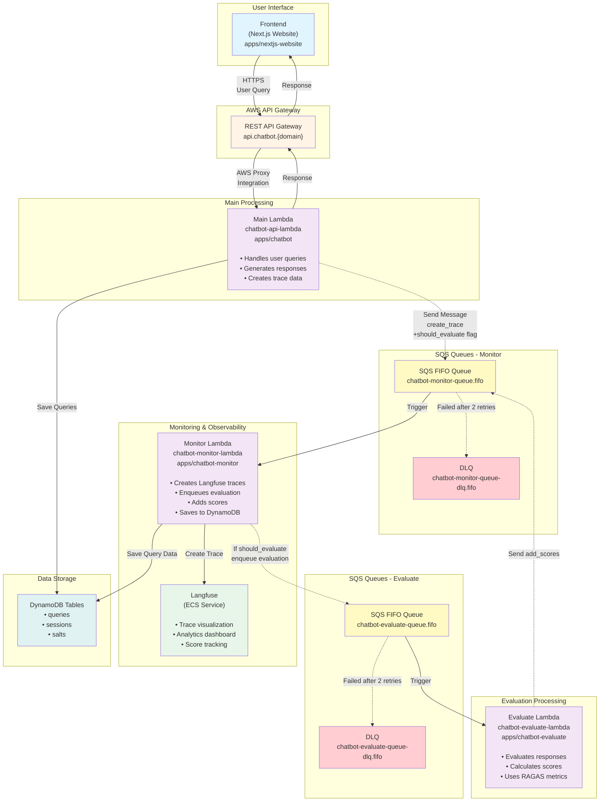

# Developer Portal Chatbot - Architecture Diagram

## Complete System Flow



## Message Flow Details

### 1. User Query Flow
```
Frontend → API Gateway → Chatbot Lambda → API Gateway → Frontend
```

### 2. Async Processing Flow (Monitor-Evaluate Chain)

**Trace Creation → Evaluation Chain:**

```
Chatbot Lambda 
  → SQS (monitor-queue) with {should_evaluate: true}
  → Monitor Lambda
      ├─ Create trace in Langfuse ✅
      └─ If should_evaluate → enqueue to evaluate-queue
                               ↓
                     Evaluate Lambda (10-30s)
                               ↓
                     SQS (monitor-queue) with add_scores
                               ↓
                     Monitor Lambda → Add scores to trace ✅
```

**Benefits:**
- ✅ **No race conditions** - Trace is created BEFORE scores are added  
- ✅ **Fast monitor lambda** - Creates trace quickly (1-2s)
- ✅ **Separation of concerns** - Each lambda does one thing
- ✅ **Conditional evaluation** - Only evaluates when `can_evaluate()` is true

## Message Types

### Chatbot → Monitor Queue

**Type: Create Trace** (with evaluation flag)
```json
{
  "operation": "create_trace",
  "data": {
    "trace_id": "abc123...",
    "user_id": "hashed_user",
    "session_id": "session_456",
    "query": "what can you do?",
    "messages": [...],
    "response": "I can help...",
    "contexts": ["ctx1", "ctx2"],
    "tags": ["ai", "ml"],
    "traceSpans": [...]
  },
  "should_evaluate": true
}
```

### Monitor → Evaluate Queue

**Type: Evaluation Request** (only if should_evaluate=true)
```json
{
  "trace_id": "abc123...",
  "query_str": "what can you do?",
  "response_str": "I can help...",
  "retrieved_contexts": ["ctx1", "ctx2"],
  "messages": [...]
}
```

### Evaluate → Monitor Queue

**Type: Add Scores**
```json
{
  "operation": "add_scores",
  "data": [
    {
      "trace_id": "abc123...",
      "name": "answer_relevancy",
      "score": 0.95,
      "comment": null,
      "data_type": "NUMERIC"
    }
  ]
}
```

## Key Features

### Fault Tolerance
- **Dead Letter Queues (DLQ)** for both evaluate and monitor queues
- **Retry Policy**: Max 2 retries before moving to DLQ
- **FIFO Queues**: Ensures message ordering and exactly-once processing
- **Message Group ID**: Uses trace_id for ordering within groups

### Scaling
- **Lambda Auto-scaling**: Both evaluate and monitor lambdas scale automatically
- **SQS Buffering**: Queues buffer messages during traffic spikes
- **Batch Processing**: Lambdas process up to 5 messages per invocation

### Security
- **VPC Integration**: All lambdas run in private subnets
- **IAM Policies**: Least-privilege access to resources
- **SSM Parameters**: Secure storage for API keys and credentials
- **PII Masking**: Presidio masks sensitive information before storing in Langfuse

## Architectural Decisions

### Why Two Separate SQS Queues?

The system uses two distinct SQS queues (`evaluate-queue` and `monitor-queue`) instead of a single shared queue. This design choice was made for the following reasons:

#### 1. Sequential Processing Pipeline
The workflow is inherently sequential, not parallel:
- **Evaluate Lambda** must run first to calculate quality scores (using RAGAS metrics)
- **Monitor Lambda** runs second to store both the trace and the calculated scores in Langfuse
- Using two queues naturally models this "enrich then store" pipeline

#### 2. Different Message Types
Each queue carries different message structures:
- **Monitor Queue**: Receives trace creation requests from Chatbot Lambda OR score data from Evaluate Lambda
  ```json
  // From Chatbot:
  {"operation": "create_trace", "data": {...}, "should_evaluate": true}
  
  // From Evaluate:
  {"operation": "add_scores", "data": [{"trace_id": "...", "score": 0.95}]}
  ```
- **Evaluate Queue**: Receives evaluation requests from Monitor Lambda
  ```json
  {
    "trace_id": "...",
    "query_str": "...",
    "response_str": "...",
    "retrieved_contexts": [...]
  }
  ```

#### 3. Independent Scaling & Performance
- **Evaluate Lambda**: Heavy processing (~10-30 seconds) with LLM calls for evaluation
- **Monitor Lambda**: Light processing (~1-2 seconds) with simple API calls to Langfuse
- Separate queues allow each lambda to scale independently based on its workload

#### 4. Better Error Handling
- Different failure modes require different retry strategies
- Separate Dead Letter Queues (DLQs) enable targeted debugging:
  - Evaluate failures → likely LLM API issues
  - Monitor failures → likely Langfuse API issues
- Failed evaluations don't affect trace creation and vice versa

#### 5. Simplified Lambda Logic
- Each lambda has a single, clear responsibility
- No need for message filtering logic ("is this message for me?")
- Easier to test, maintain, and debug

#### 6. Flexibility for Future Changes
- Can add additional processing stages to the pipeline
- Could add other consumers to the monitor queue (e.g., analytics service)
- Easy to insert new lambdas between stages if needed

#### Alternative Considered: Single Queue
Using a single queue would require:
- Both lambdas subscribing to the same queue
- Complex message filtering in each lambda
- Evaluate and Monitor processing the same message in parallel (incorrect for our sequential workflow)
- Shared DLQ mixing different failure types

**Cost Impact**: Minimal (~$0.40/month per additional queue for 1M messages)

**Decision**: Use two separate queues to maintain clear separation of concerns, better error handling, and accurate representation of the sequential processing pipeline.

## Data Flow Summary

| Step | Component | Action | Next Step |
|------|-----------|--------|-----------|
| 1 | Frontend | User submits query | → API Gateway |
| 2 | API Gateway | Routes request | → Chatbot Lambda |
| 3 | Chatbot Lambda | Generates response | → API Gateway (sync)<br/>→ SQS Monitor Queue (async) |
| 4 | API Gateway | Returns response | → Frontend |
| 5 | Monitor Lambda | Creates trace in Langfuse<br/>Enqueues evaluation (if needed) | → Langfuse ECS<br/>→ SQS Evaluate Queue (conditional) |
| 6 | Evaluate Lambda | Evaluates response quality (10-30s) | → SQS Monitor Queue |
| 7 | Monitor Lambda | Adds scores to existing trace | → Langfuse ECS |
| 8 | Monitor Lambda | Saves query data to database | → DynamoDB |
