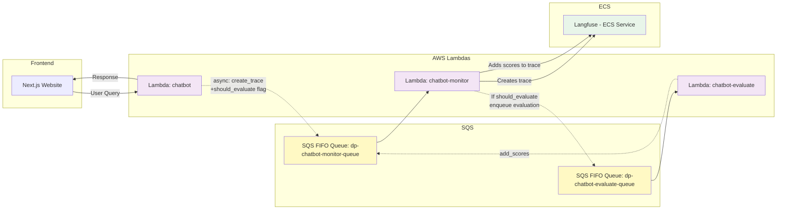

# Chatbot System Architecture

## Architecture Notes

### Monitor-Evaluate Chain
- **Chatbot** sends trace creation messages to **Monitor Queue** only
- **Monitor Lambda** creates traces in Langfuse and conditionally enqueues evaluation
- **Evaluate Lambda** processes evaluations (10-30s) and sends scores back to Monitor Queue
- **Monitor Lambda** receives scores and adds them to existing traces

### Benefits
- ✅ No race conditions - trace exists before scores are added
- ✅ Fast monitor lambda - creates trace in 1-2s
- ✅ Separation of concerns - each lambda has one responsibility
- ✅ Conditional evaluation - only evaluates when needed

### Queue Naming
- Use FIFO queues (`.fifo` suffix) for message ordering
- Environment-specific naming: `dp-chatbot-{queue-name}-{env}.fifo`
- Examples: `dp-chatbot-monitor-queue-dev.fifo`, `dp-chatbot-evaluate-queue-prod.fifo`
